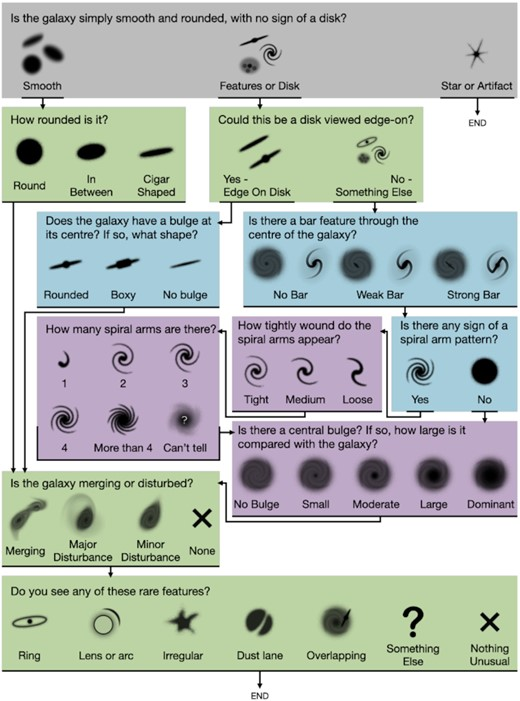
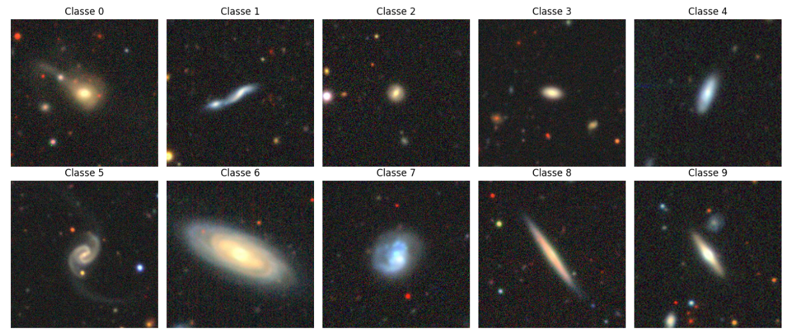
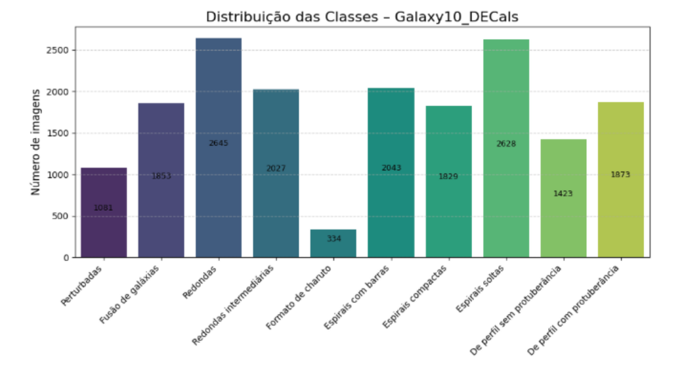
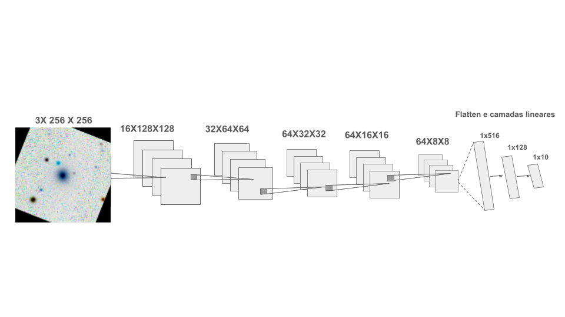
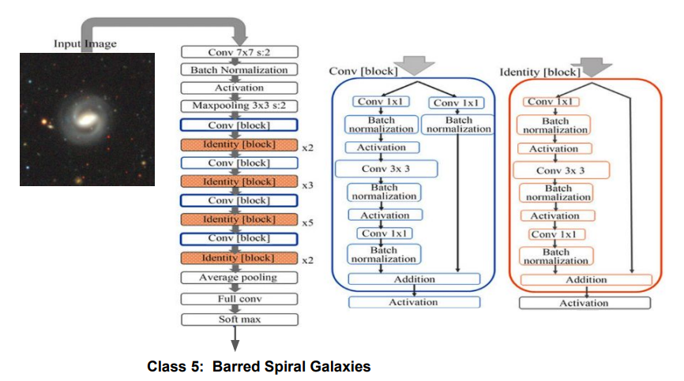
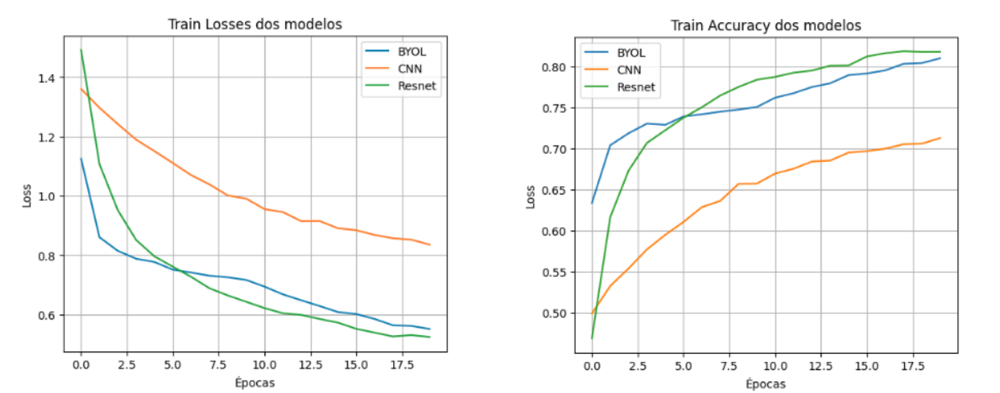
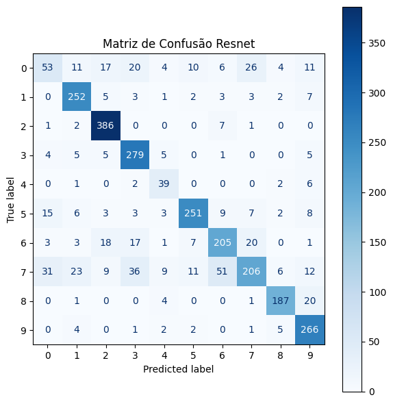
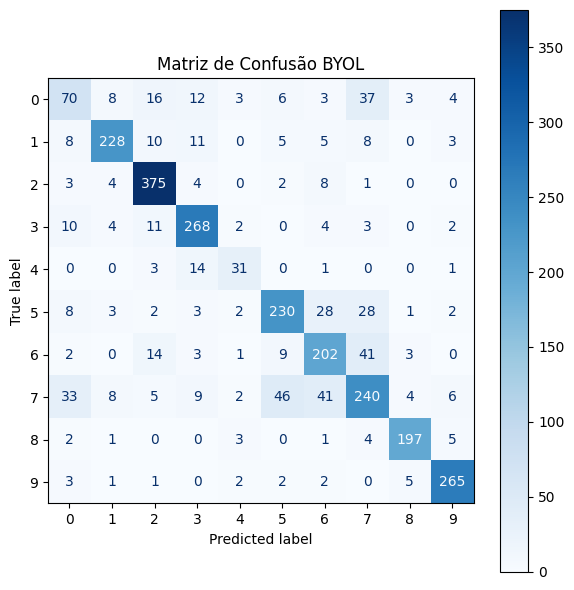
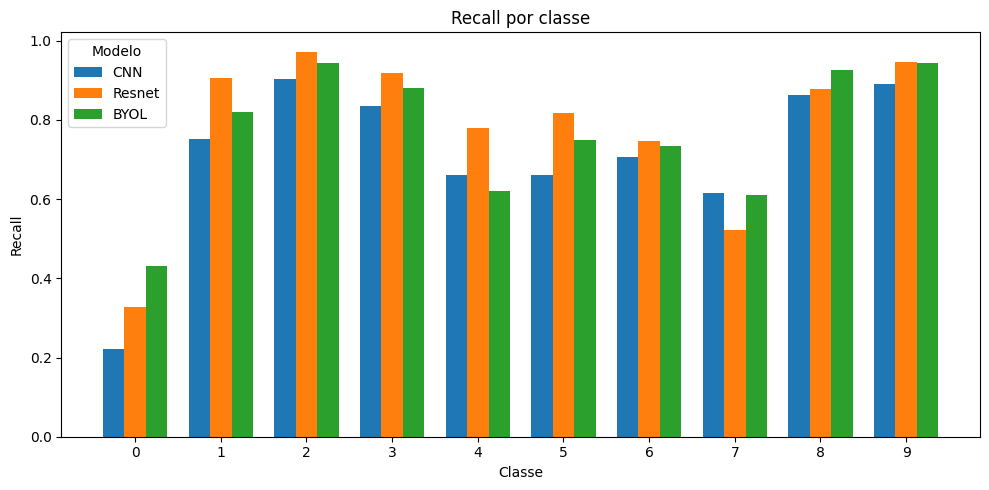
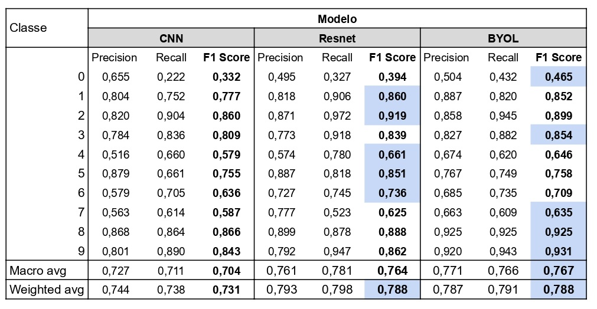

# Classification of Galaxies using CNN, ResNet-50 and BYOL

This repository contains implementations of a Convolutional Neural Network (CNN), ResNet-50, and Bootstrap Your Own Latent (BYOL). The main objective of this work is to compare these architectures in a galaxy morphology classification task using the Galaxy10 DECaLS dataset.

The collaborative work was developed by **Deyvisson Garcês**, **Inayê Melo**, **Eduardo Cherobin**, **Thamara Medeiros**,  and **Nicoly Rodrigues**.
---
## Galaxy10 Decision Tree

The decision tree used to define the Galaxy10 morphological classes is shown below. This hierarchy was used as a reference for the classification task.

---
## Dataset

The Galaxy10 DECaLS dataset consists of galaxy images divided into 10 morphological classes.

The dataset is highly imbalanced. Some classes contain up to eight times more samples than others, as illustrated in the figure below.

---

## Models

### Convolutional Neural Network (CNN)

The CNN architecture was designed specifically for this task, aiming to balance model complexity and generalization performance.

---

### ResNet-50

ResNet-50 is a deep residual network that employs skip connections to mitigate the vanishing gradient problem and enable the training of deeper architectures.

---

### BYOL (Bootstrap Your Own Latent)

BYOL is a self-supervised learning framework that learns image representations without the use of negative samples. The learned representations are later fine-tuned for the galaxy classification task.

---

## Experimental Results

Several experiments were conducted using the architectures described above. Training and validation losses, as well as accuracy curves, are shown below.

---

## Confusion Matrices

The confusion matrices below illustrate the classification performance of each model on the test set.

### CNN

### ResNet-50

### BYOL

---

## Recall per Class

The following figure shows the recall obtained for each class, highlighting the impact of class imbalance on the models' performance.

---

## Quantitative Metrics

The table below summarizes the main quantitative metrics obtained for each model.

